

  

  
  
  
  
  

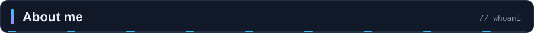


- 🎓 Computer Engineering @ **Helwan University** (Distinction, 89%)
- 🧱 Full-stack with the **MERN stack**, plus **desktop apps with Electron.js**
- 🔭 Currently deepening my **React.js** and **Node.js** expertise
- ✨ I care about **clean, maintainable, efficient code**

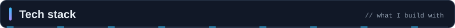


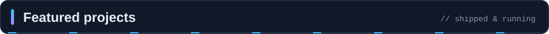

<table align="center">
  <tr>
    <td align="center">
      <a href="https://maqhaa.abdelrahmanashraf.dev/"></a> 
      <a href="https://maqhaa.abdelrahmanashraf.dev/">Live site</a>
    </td>
    <td align="center">
      <a href="https://github.com/Abdelrahman0xFF/nexus-academy"></a> 
      <a href="https://nexus.abdelrahmanashraf.dev/">Live demo</a> · <a href="https://github.com/Abdelrahman0xFF/nexus-academy">Source</a>
    </td>
  </tr>
  <tr>
    <td align="center">
      <a href="https://github.com/Abdelrahman0xFF/zagel"></a> 
      <a href="https://github.com/Abdelrahman0xFF/zagel">Source</a>
    </td>
    <td align="center">
      <a href="https://github.com/Abdelrahman0xFF/clinic-appointment"></a> 
      <a href="https://github.com/Abdelrahman0xFF/clinic-appointment">Source</a>
    </td>
  </tr>
</table>

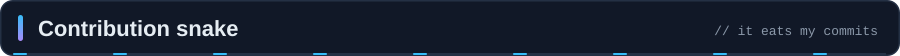

  <picture>
    <source media="(prefers-color-scheme: dark)" srcset="https://raw.githubusercontent.com/Abdelrahman0xFF/Abdelrahman0xFF/output/github-snake-dark.svg">
    <source media="(prefers-color-scheme: light)" srcset="https://raw.githubusercontent.com/Abdelrahman0xFF/Abdelrahman0xFF/output/github-snake.svg">
    
  </picture>

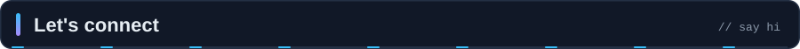

